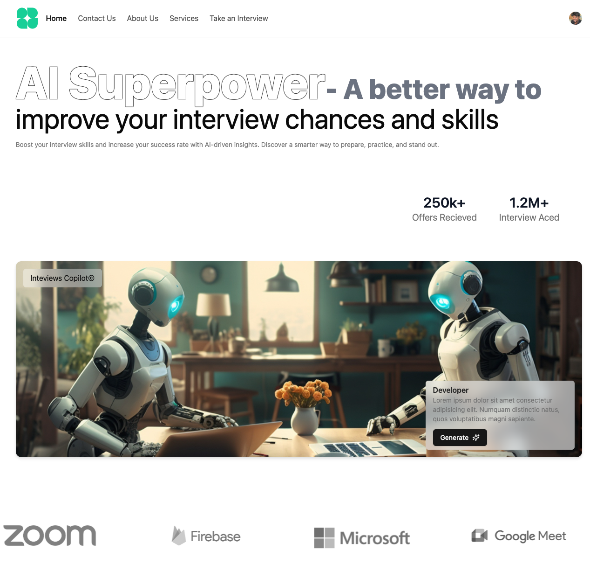

# React AI Mock Interview

React AI Mock Interview is an innovative web application designed to simulate real-world mock interviews using AI. With seamless user authentication, an intuitive interface, and integration with advanced AI, this project serves as an invaluable tool for interview preparation.

## Assets

Please download the assets used in this projects from here : [Download](https://drive.google.com/drive/folders/1aAiHz6FApIc2IXOsq-TOHHZYcu-aAvrN?usp=drive_link)



## Features

- AI-Powered Mock Interviews  
  Leverage Google Gemini AI to simulate realistic interview scenarios, evaluate responses, and provide personalized feedback.

- Seamless Authentication  
  User authentication is powered by Clerk, ensuring secure and efficient access control.

- Intuitive UI  
  Built with Shadcn UI, the application boasts a modern and responsive interface for a seamless user experience.

- Data Management  
  All user progress, interview analytics, and configurations are stored securely in Google Firebase Firestore.

- Dynamic Interview Customization  
  Customize interviews based on job roles, difficulty levels, and domains.

---

## Tech Stack

- Frontend: React.js
- Authentication: Clerk
- UI Framework: Shadcn UI
- Database: Google Firebase Firestore
- AI Integration: Google Gemini AI

---

## Getting Started

### Installation

#### Clone this repository:

```
git clone https://github.com/varssshini/Mock-Interview.git
```

#### Navigate to the project directory:

```
cd react-ai-mock-interview
```

#### Install dependencies

```
npm i -g pnpm
pnpm install
```

#### Start the development server

```
pnpm run dev
```

#### Firebase Initialization

```
firebase init
```

#### Firebase Deploy

```
firebase deploy
```

#### Project Build

```
pnpm run build
```

## Environment Variable

Ensure the following environment variables are set up in a .env file:

```
VITE_FIREBASE_API_KEY=YOUR_API_KEY_REF
VITE_FIREBASE_AUTH_DOMAIN=YOUR_API_KEY_REF
VITE_FIREBASE_PROJECT_ID=YOUR_API_KEY_REF
VITE_FIREBASE_STORAGE_BUCKET=YOUR_API_KEY_REF
VITE_FIREBASE_MESSAGING_SENDER_ID=YOUR_API_KEY_REF
VITE_FIREBASE_APP_ID=YOUR_API_KEY_REF
```

## Key Features

- AI-Driven Insights
  Provides real-time feedback on your interview performance, highlighting strengths and areas for improvement.

- User-Friendly Dashboard
  Track your progress, access past interviews, and download detailed performance reports.

- Interactive Questionnaires
  Engage with diverse question types, including multiple-choice, scenario-based, and technical coding challenges.

# Author

## SHRIVARSHINI GOPINATH

